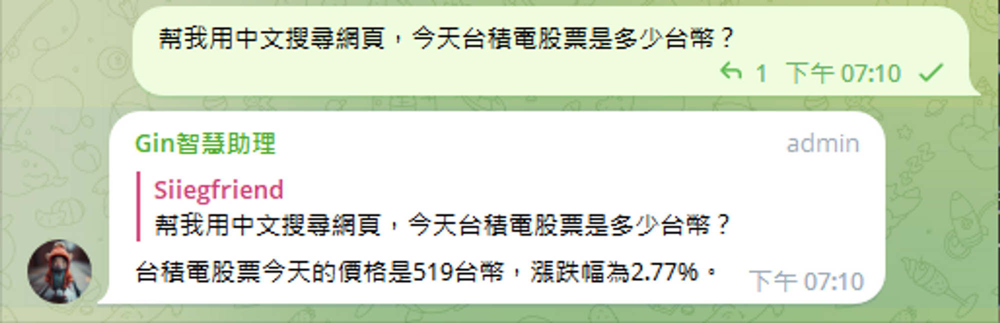
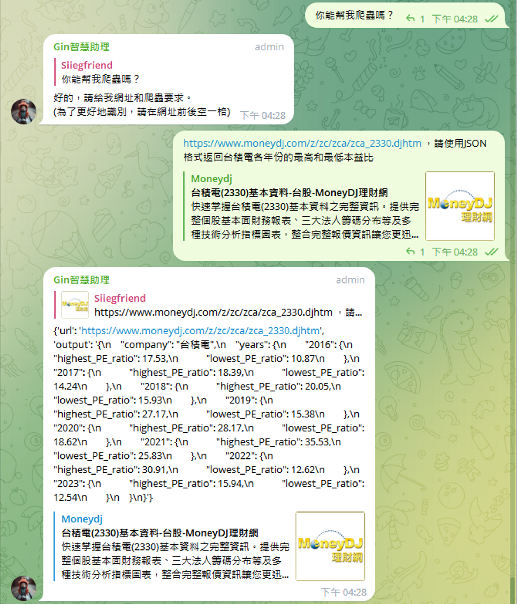
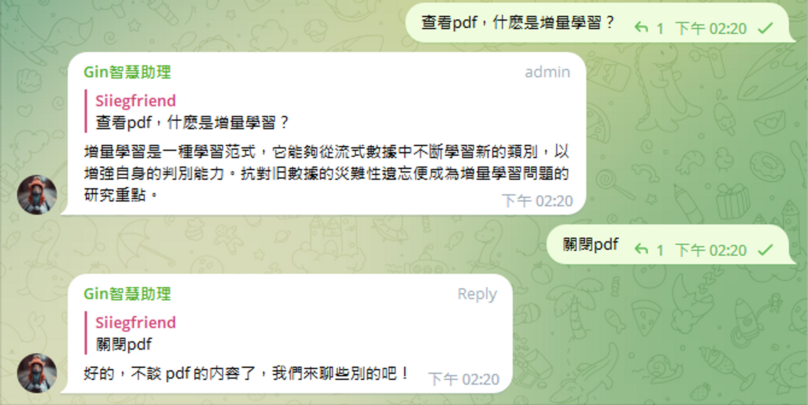
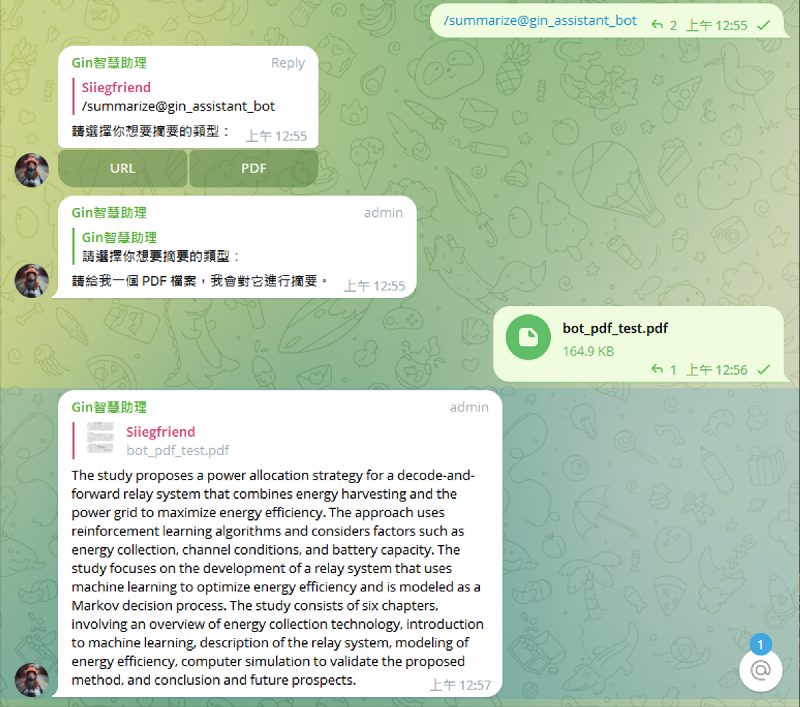
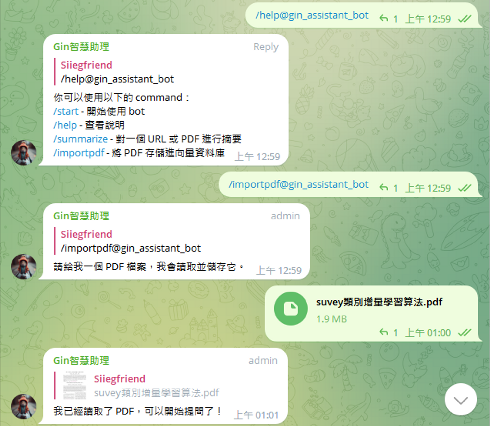

# Telegram AI Assistant

Telegram AI Assistant 是一個項目，旨在為 Telegram 用戶提供一個強大而多功能的聊天機器人。它利用大語言模型（如 OpenAI 的 GPT-3、Google 的 Bard、Hugging Face 的模型等）和各種 API 通過自然語言命令執行各種任務和功能。其中一些特點包括：

- 利用向量數據庫儲存對話內容，不僅大幅減少 Token 的消耗，還能讓 AI 記住至少 7 天以前的對話內容，提高對話的連貫性和深度。
- 採用文字偵測技術，讓使用者可以用自然語言執行各種特定功能，同時節省 Token 的使用，提高效率和靈活性。
- 運用文本分塊方法，突破 OpenAI 的 Token 限制，實現對網頁內容和 PDF 內容的精準總結和分析。
- 將 PDF 存入專屬的向量數據庫，實現對 PDF 內容的自由問答，並且不受 PDF 文件的導入數量限制，提供豐富和多元的資訊來源。
- 使用 Serper API，實現上網搜尋資料，擴大 AI 的知識範圍和應用場景。
- 自動解讀網址，根據用戶輸入的需求輸出特定格式（如：JSON）的頁面資訊，實現爬蟲功能。
- 以上所有功能可以在同一個對話內無縫切換，并且能自定義語言模型在對話中扮演的角色，提供個性化和人性化的對話體驗。

## 安裝

要使用 Telegram AI Assistant，你需要有一個 Telegram Bot 和一個有權訪問 GPT-3 的 OpenAI 帳號。你還需要安裝一些依賴項：

- Python 3.8
- langchain==0.0.173
- pinecone_client==2.2.1
- PyPDF2==3.0.1
- python-dotenv==1.0.0
- python-telegram-bot==13.3

你可以通過運行以下命令來安裝它們：

```bash
pip install -r requirements.txt
```

你還需要設置一些環境變量：

- OPENAI_API_KEY: 你的 OpenAI API 密鑰
- TELEGRAM_TOKEN: 你的 Telegram Bot Token 密鑰
- SERPER_API_KEY: 你的 Serper API 密鑰
- PINECONE_API_KEY: 你的 Pinecone 向量數據庫 API 密鑰
- PINECONE_ENV: 你的 Pinecone 向量數據庫環境名稱（xx-xxx-xx）

## 使用

要啟動 Telegram AI Assistant，運行：

```bash
python main.py
```

然後你可以打開 Telegram 並向你的機器人發送消息。你可以使用自然語言來觸發不同的功能。例如：

- 使用關鍵字 "搜尋網頁"，如："幫我搜尋網頁，台積電今天的股價是台幣多少？" 將返回搜尋結果。
<p align="center">
    
</p>
- 使用關鍵字 "幫我爬蟲" 後會請求用戶給出網址和要求。這時候回復如： "https://www.moneydj.com/z/zc/zca/zca_2330.djhtm  請使用 JSON 格式返回台積電各年份的最高和最低本益比"，將返回 JSON 格式的資料。
<p align="center">
    
</p>
- 導入使用關鍵字 "查看pdf" 後，之後的對話就會圍繞 pdf 的數據庫資料來進行問答，直到回復關鍵字 "關閉pdf" 後恢復成一般聊天模式。這可以避免 pdf 的數據庫和一般聊天的數據庫出現交曡而造成不必要的混亂。
<p align="center">
    
</p>

你也可以正常地和機器人聊天，它會嘗試以友好而有趣的方式回應。你可以通過使用命令來進行一些操作，例如：

- /start - 開始使用 bot
- /help - 查看說明
- /summarize - 對一個 URL 或 PDF 進行摘要
<p align="center">
    
</p>
- /importpdf - 將 PDF 存儲進向量資料庫
<p align="center">
    
</p>

## 許可證

本項目採用 MIT 許可證 - 請參閱 [LICENSE.txt](LICENSE.txt) 檔案了解詳情。

## 聯繫

如果你有任何問題或反饋，請隨時聯繫我。
